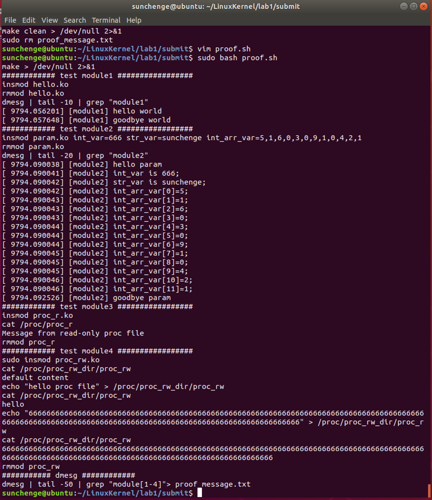
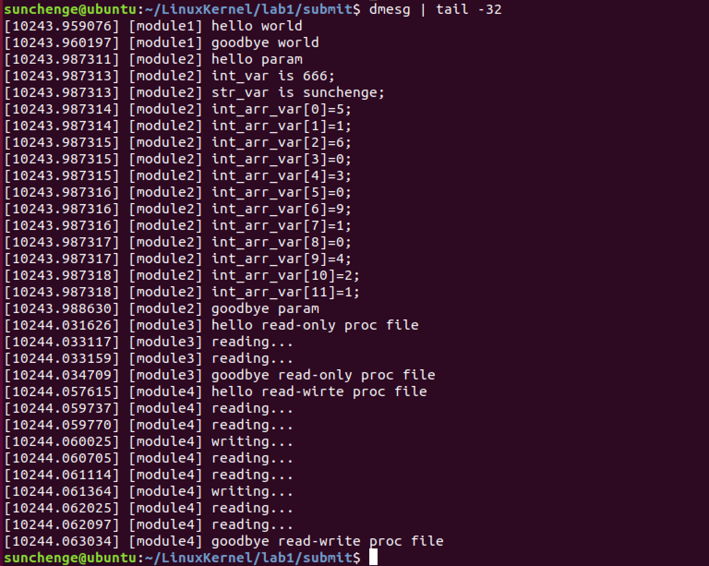
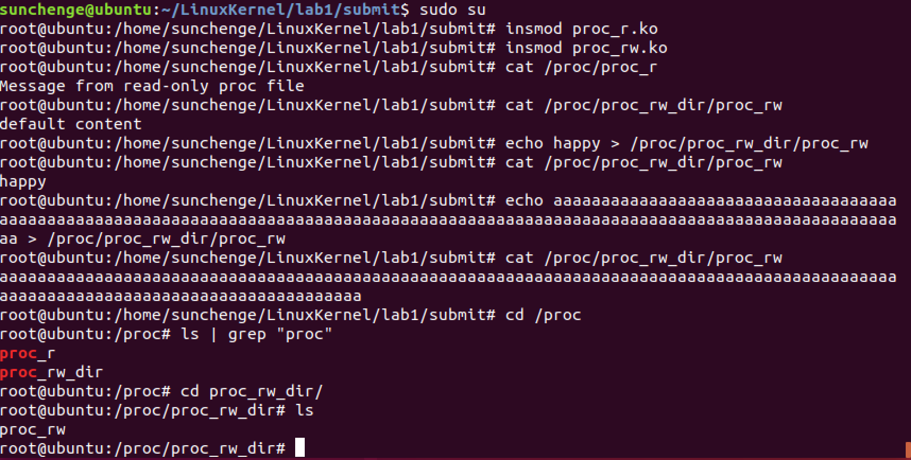

# <center>Linux Kernel Project 1 Report

<center>孙晨鸽 516030910421</center>

### 实验过程

#### 模块一
模块一的实现比较hello world，对照着老师的ppt基本就可以实现了。

#### 模块二
模块二的精髓在于```#include <linux/moduleparam.h>```。对于```int```和```char*```为代表的单变量，我们可以使用```module_param(name, type, perm)```。
	
```module_param(name, type, perm)```是用宏实现的，

```c
#define module_param_named(name, value, type, perm)    \
param_check_##type(name, &(value));                    \
module_param_cb(name, &param_ops_##type, &value, perm);\
__MODULE_PARM_TYPE(name, #type)
```

```name```为参数名， ```type```为参数类型，```perm```为权限。type的取值可以是```byte```(相当于 ```unsigned char```), ```short, ushort, int, uint, long, ulong, charp```(相当于 ```char
*```，不超过 1024 字节的字符串), ```bool```(相当于 ```int```), ```invbool```(相当于 ```int```)。

对于数组变量，我们可以使用```module_param_array(name, type, num, perm)```。和```module_param```对比多了一个```num```参数，代表数组的长度，由于是外界参数决定的，这里应传变量的指针。

两个传参函数的用法如下：

```c
static int int_var = 1;
static char* str_var = "hello";
static int int_arr_var[20]={0};
static int num = 1;

module_param(int_var, int, S_IRUGO);
module_param(str_var, charp, S_IRUGO);
module_param_array(int_arr_var, int, &num, S_IRUGO);
```

对于```perm```我们可以用数字如```0444```也可以用```<linux/stat.h>```中的```S_IRUGO```。表示owner, group, other可读。数字后三位对应owner, group, other，其数值0-7二进制对应```rwx```。

#### 模块三
模块三要求创建一个只读的proc file，要调用procfs的函数需要包含```<linux/proc_fs.h>```，由于我们还要读这个文件，也就涉及到了用户态与内核态的交互，这时我们需要包含```<linux/uaccess.h>```来完成用户态和内核态的信息传递。

我们首先要创建一个指向这个proc file的entry（其作用与指针类似）。entry的类型为```struct proc_dir_entry *```。**ppt上创建entry使用的**```create_proc_entry(name, mode, parent, function, data)```**和**```create_proc_read_entry```**。我在编译的时候遇到了一些error，发现这两个函数在Linux 3.10中就已经被弃用了（准确的说是被删除了），我们应该使用**```proc_create(name, mode, parent, file_ops)```**，对应的**```remove_proc_entry```**虽然还没被删除，也应替换为**```proc_remove``` ，**后者在用起来也更加优雅**。由于我直接将文件创建在了```/proc```下，对应```parent=NULL```。

由于我们还要读这个proc file，我们还要实现一个read函数，将一个字符串打印到命令行（用户态）。

我们可以通过```struct file_operations```来制定文件操作， ```file_operations```定义如下：

```c
struct file_operations {  
    struct module *owner;  
    loff_t (*llseek) (struct file *, loff_t, int);  
    ssize_t (*read) (struct file *, char *, size_t, loff_t *);  
    ssize_t (*write) (struct file *, const char *, size_t, loff_t *);  
    int (*readdir) (struct file *, void *, filldir_t);  
    unsigned int (*poll) (struct file *, struct poll_table_struct *);  
    int (*ioctl) (struct inode *, struct file *, unsigned int, unsigned long);  
    int (*mmap) (struct file *, struct vm_area_struct *);  
    int (*open) (struct inode *, struct file *);  
    int (*flush) (struct file *);  
    int (*release) (struct inode *, struct file *);  
    int (*fsync) (struct file *, struct dentry *, int datasync);  
    int (*fasync) (int, struct file *, int);  
    int (*lock) (struct file *, int, struct file_lock *);  
    ssize_t (*readv) (struct file *, const struct iovec *, unsigned long, loff_t *);  
    ssize_t (*writev) (struct file *, const struct iovec *, unsigned long, loff_t *);  
};
```

我们可以通过这些函数指针得到对应操作如读操作所对应的函数参数及返回值。对于```read```函数，它的声明为
```static ssize_t my_read(struct file *file, char __user *ubuf, size_t count, loff_t *ppos)；```。其中```file```为内核态做读操作的source file，```ubuf```为用户态等待数据写入的target buffer，```count```为用户态buffer的大小，```ppos```为file的偏移量。

我们需要做的是将我们要打印到命令行的字符串写入用户态的```ubuf```中，这时就用到了```<linux/uaccess.h>```中的```copy_to_user(targer_user_buffer, source_kernel_buffer, len);```。在此之前我们可以通过```sprintf```格式化输出，比如加个```\n```。

```c
static ssize_t my_read(struct file *file, char __user *ubuf, size_t count, loff_t *ppos) {
	char buf[BUFSIZE];
	int len = 0;
	printk(KERN_DEBUG "[module3] reading...\n");
	if (*ppos > 0 || count < BUFSIZE)
		return 0;
	len += sprintf(buf, "%s\n", content);
	if (copy_to_user(ubuf, buf, len))
		return -EFAULT;
	*ppos = len;
	return len;
}
```

#### 模块四

模块四在模块三的基础上增加了

* 创建一个/proc目录
* 使文件可写
* 处理写时buffer溢出

##### 创建目录

创建目录和entry的方式差不多，只是使用了```proc_mkdir```，后来创建的entry的parent参数就设为该目录的```proc_dir_entry```指针。

##### 使文件可写

根据之前的```file_operations```的结构，我们可以知道```write```函数的定义应该为```static ssize_t my_write(struct file *file, const char __user *ubuf, size_t count, loff_t *ppos);```。其中```file```为内核态目标文件， ```ubuf```为用户态源缓冲区， ```count```为用户态要写入的消息的大小， ```ppos```为file的偏移量。

我们需要做的是将```ubuf```中```count```大小的消息写入一个内核态中的```static char * buffer```。这时我们需要用到```<linux/uaccess.h>```中的```copy_from_user(target, source, len)```。我们同样可以使用```sscanf```格式化输入。

##### 处理buffer溢出

在写入较大信息时，我们预先设定的buffer可能会产生溢出问题。我的解决方案是对buffer使用动态内存分配，不断扩容buffer。首先比较```buffer_size```和```count```的大小，当```count```大于```buffer_size```时，使用```kzalloc```对buffer重新分配```count```大小的空间，并使```buffer_size=count+1```。

```kzalloc```是内核态的动态内存分配，在```<linux/slab.h>```中，与之对应的释放函数为```kfree```。它的作用和用户态我们熟悉的```malloc```和```free```时相同的，不同在于参数增加了一个flags，表示分配内存的方法，我是用了```GFP_KERNEL```表示正常分配内存。其实```<linux/slab.h>```中也有```kmalloc```，它其实才是内核版的```malloc```，区别在于```kzalloc```会将内存初始化为0。

由于C语言里没有智能指针，使用这种方式处理buffer溢出就要疯狂检查是不是```kfree```掉了内存，这里有几个需要注意的地方就是参数错误/返回错误退出之前一定要free。

扩容的具体实现逻辑如下：

```c
if (count > buffer_size) {
		buffer_size = count+1;
		if (buffer) 
			kfree(buffer);
		buffer = (char*) kzalloc(sizeof(char) * buffer_size, GFP_KERNEL);
}
```

### 实验结果

#### 脚本验证
源码中有一个```proof.sh```的脚本，运行

```bash
sudo bash proof.sh
```
可以看到四个模块的运行效果。其中与实验内容相关的内核日志写入```proof_message.txt```中（运行```proof.sh```后会出现）。```bash clean.sh```会清理掉编译产生的二进制文件等。

脚本验证的结果如下：



此时dmesg



#### 单独验证

模块三四的读写操作



### 实验心得

通过这次实验，我认识到我对C语言的掌握是多么薄弱，看内核代码（仅仅是大作业涉及的头文件就。。。）中的那些宏仿佛像看天书，对C语言的知识恐怕要恶补一下了。

内核编程的资料感觉好少（也有可能只是我没有找到），在写read,write函数时一开始没什么头绪去github上招灵感，发现大家都是在写高级的驱动，入门级别的资料很多还停留在create\_proc\_entry的原始时期。于是只能硬看代码，好在学姐给了一个```#include <linux/seq_file.h>```，在这个库中找到了一些写法。其实对于只读文件，```seq_file```库给出了很优雅的写法，但由于还是想自己处理一下copy\_to\_user，于是写了最原始的read函数。

一个lab做下来感觉自己对linux的恐惧消失了不少，非常有收获！