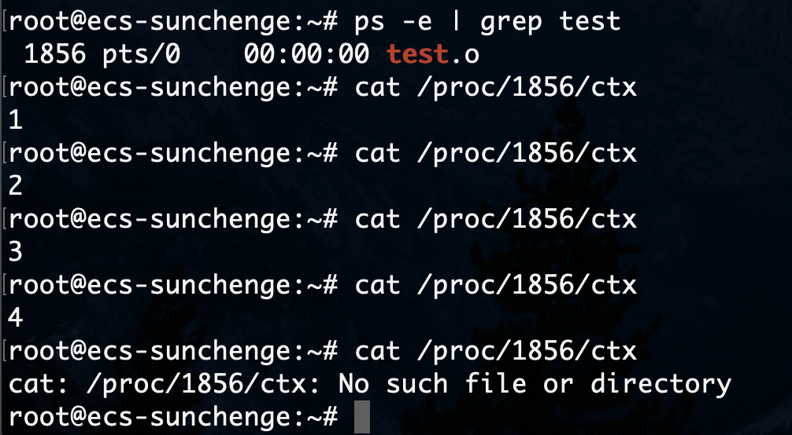
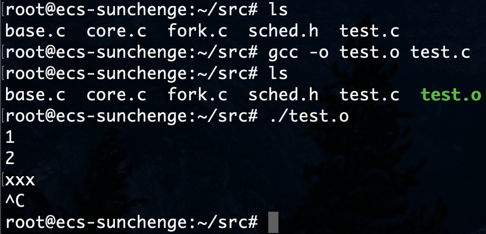

# <center>Linux Kernel Project 2 Report

<center>孙晨鸽 516030910421</center>

### 实验过程

* 内核版本 ： 5.5.9
* 平台: 华为云 x 鲲鹏通用计算增强型 | kc1.large.2 | 2vCPUs | 4GB x Ubuntu 18.04 64bit with ARM
#### 阅读源码

根据实验指导，我们需要在

* ```<include/linux/sched.h>```中声明```int ctx```
* ```<kernel/fork.c>```中初始化```ctx=0```
* ```<kernel/sched/core.c>```中在调度时```ctx++```
* ```<fs/proc/base.c>```中创建只读```/proc/PID/ctx```

这就要求我们阅读源码，找到合适的位置做这些操作。

##### include/linux/sched.h

```sched.h```中定义了```struct task_struct```:

```c++
struct task_struct {
#ifdef CONFIG_THREAD_INFO_IN_TASK
        struct thread_info              thread_info;
#endif
        volatile long                   state;
        randomized_struct_fields_start
        void                            *stack;
        refcount_t                      usage;
        unsigned int                    flags;
        unsigned int                    ptrace;
        ....
        randomized_struct_fields_end
        struct thread_struct            thread;
};
```
根据注释，```thread_info```必须在```task_struct```开头，```thread```必须在```task_struct```的结尾。 ```randomized_struct_fields_start```标志着```task_struct```随机化部分的开始，我们可以在这之后添加数据成员。

```c++
        randomized_struct_fields_start
        void                            *stack;
        refcount_t                      usage;
        unsigned int                    flags;
        unsigned int                    ptrace;
        /* Count how many times does CPU schedule this process */
        unsigned int                    ctx;
```

##### kernel/fork.c

我们知道创建子进程最主要的方法就是fork，在```fork.c```中找到fork系统调用的定义:

```c++
#ifdef __ARCH_WANT_SYS_FORK
SYSCALL_DEFINE0(fork)
{
#ifdef CONFIG_MMU
        struct kernel_clone_args args = {
                .exit_signal = SIGCHLD,
        };

        return _do_fork(&args);
#else
        /* can not support in nommu mode */
        return -EINVAL;
#endif
}
```
我们看到fork的主要逻辑在```_do_fork(&args)```中，同样的```vfork,clone,kernel_thread```等创建进程的系统调用也都使用了这个函数。

```c++
long _do_fork(struct kernel_clone_args *args)
{
        u64 clone_flags = args->flags;
        struct completion vfork;
        struct pid *pid;
        // 新进程的进程描述符 p
        struct task_struct *p;
        int trace = 0;
        long nr;

        // 判断是不是被调试程序trace，若被traced：
        if (!(clone_flags & CLONE_UNTRACED)) {
                if (clone_flags & CLONE_VFORK)
                        trace = PTRACE_EVENT_VFORK;
                else if (args->exit_signal != SIGCHLD)
                        trace = PTRACE_EVENT_CLONE;
                else
                        trace = PTRACE_EVENT_FORK;

                if (likely(!ptrace_event_enabled(current, trace)))
                        trace = 0;
        }
        // 设置子进程进程描述符和其他内核数据结构，拷贝寄存器和进程环境
        p = copy_process(NULL, trace, NUMA_NO_NODE, args);
        add_latent_entropy();
        if (IS_ERR(p))
                return PTR_ERR(p);
        trace_sched_process_fork(current, p);
        pid = get_task_pid(p, PIDTYPE_PID);
        nr = pid_vnr(pid);
        if (clone_flags & CLONE_PARENT_SETTID)
                put_user(nr, args->parent_tid);

        if (clone_flags & CLONE_VFORK) {
                p->vfork_done = &vfork;
                init_completion(&vfork);
                get_task_struct(p);
        }
        // 将进程插入running_queue，进程状态为TASK_RUNNING
        wake_up_new_task(p);
        if (unlikely(trace))
                ptrace_event_pid(trace, pid);
        // 如果指定了CLONE_VFORK标志，它会先让子进程运行
        if (clone_flags & CLONE_VFORK) {
                if (!wait_for_vfork_done(p, &vfork))
                        ptrace_event_pid(PTRACE_EVENT_VFORK_DONE, pid);
        }
        put_pid(pid);
        return nr;
}
```
其中创建新进程（旧进程的拷贝）的操作是在```p = copy_process(NULL, trace, NUMA_NO_NODE, args);```中完成的，返回新进程的```task_struct```：

```c++
static __latent_entropy struct task_struct *copy_process(struct pid *pid, int trace, int node, struct kernel_clone_args *args)；
```
其中```p = dup_task_struct(current, node);```创建了新进程的进程描述符，我们可以在这之后初始化```p->ctx=0;```

```c++
p = dup_task_struct(current, node);
        if (!p)
                goto fork_out;
        /* Initialize the schedule counter */
        p->ctx = 0;
```

##### kernel/sched/core.c

我们可以通过```schedule()```选择运行的进程。

```c++
asmlinkage __visible void __sched schedule(void)
{
        struct task_struct *tsk = current;
        sched_submit_work(tsk);
        do {
                preempt_disable();
                // 真正的schedule
                __schedule(false);
                sched_preempt_enable_no_resched();
        } while (need_resched());
        sched_update_worker(tsk);
}
EXPORT_SYMBOL(schedule);
```

其中最重要的逻辑是在```__schedule(bool)```中实现的：

```c++
static void __sched notrace __schedule(bool preempt)
{
        struct task_struct *prev, *next;
        unsigned long *switch_count;
        struct rq_flags rf;
        struct rq *rq;
        int cpu;
        cpu = smp_processor_id();
        rq = cpu_rq(cpu);
        prev = rq->curr;
        schedule_debug(prev, preempt);
        if (sched_feat(HRTICK))
                hrtick_clear(rq);
        local_irq_disable();
        rcu_note_context_switch(preempt);
        rq_lock(rq, &rf);
        smp_mb__after_spinlock();
        rq->clock_update_flags <<= 1;
        update_rq_clock(rq);
        switch_count = &prev->nivcsw;
        if (!preempt && prev->state) {
                if (signal_pending_state(prev->state, prev)) {
                        prev->state = TASK_RUNNING;
                } else {
                        deactivate_task(rq, prev, DEQUEUE_SLEEP | DEQUEUE_NOCLOCK);

                        if (prev->in_iowait) {
                                atomic_inc(&rq->nr_iowait);
                                delayacct_blkio_start();
                        }
                }
                switch_count = &prev->nvcsw;
        }
        // 选下一个执行的进程
        next = pick_next_task(rq, prev, &rf);
        clear_tsk_need_resched(prev);
        clear_preempt_need_resched();
        if (likely(prev != next)) {
                rq->nr_switches++;
                // rq->curr = next;
                RCU_INIT_POINTER(rq->curr, next);
                // 我们可以在这里增加计数
                // rq->curr->ctx++;
                ++*switch_count;
                trace_sched_switch(preempt, prev, next);
                // 上下文切换
                rq = context_switch(rq, prev, next, &rf);
        } else {
                rq->clock_update_flags &= ~(RQCF_ACT_SKIP|RQCF_REQ_SKIP);
                rq_unlock_irq(rq, &rf);
        }

        balance_callback(rq);
}
```

##### fs/proc/base.c

```base.c```中定义了```/proc/xxx```下的文件/目录:

```c++
static const struct pid_entry tgid_base_stuff[] = {
	DIR("task",       S_IRUGO|S_IXUGO, proc_task_inode_operations, proc_task_operations),
	DIR("fd",         S_IRUSR|S_IXUSR, proc_fd_inode_operations, proc_fd_operations),
	DIR("map_files",  S_IRUSR|S_IXUSR, proc_map_files_inode_operations, proc_map_files_operations),
	DIR("fdinfo",     S_IRUSR|S_IXUSR, proc_fdinfo_inode_operations, proc_fdinfo_operations),
	DIR("ns",	  S_IRUSR|S_IXUGO, proc_ns_dir_inode_operations, proc_ns_dir_operations),
#ifdef CONFIG_NET
	DIR("net",        S_IRUGO|S_IXUGO, proc_net_inode_operations, proc_net_operations),
#endif
	REG("environ",    S_IRUSR, proc_environ_operations),
	REG("auxv",       S_IRUSR, proc_auxv_operations),
	ONE("status",     S_IRUGO, proc_pid_status),
	ONE("personality", S_IRUSR, proc_pid_personality),
	ONE("limits",	  S_IRUGO, proc_pid_limits),
.....
```
其中```DIR,REG,ONE```都是由宏```NOD```定义，```NOD```的定义如下：

```c++
#define NOD(NAME, MODE, IOP, FOP, OP) {		\
	.name = (NAME),				\
	.len  = sizeof(NAME) - 1,		\
	.mode = MODE,				\
	.iop  = IOP,				\
	.fop  = FOP,				\
	.op   = OP,				\
}
```

我们若实现一个只读的```ctx```文件，可以使用```ONE```宏:

```c++
#define ONE(NAME, MODE, show)			\
	NOD(NAME, (S_IFREG|(MODE)),		\
	NULL, &proc_single_file_operations,     \
	{ .proc_show = show } )
```

```c++
ONE("ctx", S_IRUGO, proc_pid_ctx)
```
其中```proc_pid_ctx```的实现使用```<linux/seq_file.h>```：

```c++
static int proc_pid_ctx(struct seq_file *m, struct pid_namespace *ns, struct pid *pid, struct task_struct *task）{
        seq_printf(m, "%d\n", task->ctx);
        return 0;
}                       
```

#### 修改内容

```diff
root@ecs-sunchenge:/usr/src# diff -Nrup linux-5.5.9.origin/include/linux/sched.h linux-5.5.9/include/linux/sched.h
--- linux-5.5.9.origin/include/linux/sched.h	2020-04-21 14:20:05.332023592 +0800
+++ linux-5.5.9/include/linux/sched.h	2020-04-21 14:34:20.661645774 +0800
@@ -649,6 +649,9 @@ struct task_struct {
 	unsigned int			flags;
 	unsigned int			ptrace;
 
+	/* Count how many times does CPU schedule this process */
+	unsigned int			ctx;
+
 #ifdef CONFIG_SMP
 	struct llist_node		wake_entry;
 	int				on_cpu;
root@ecs-sunchenge:/usr/src# diff -Nrup linux-5.5.9.origin/kernel/fork.c linux-5.5.9/kernel/fork.c
--- linux-5.5.9.origin/kernel/fork.c	2020-04-21 14:20:09.288086391 +0800
+++ linux-5.5.9/kernel/fork.c	2020-04-21 14:52:02.822560067 +0800
@@ -1912,6 +1912,9 @@ static __latent_entropy struct task_stru
 	if (!p)
 		goto fork_out;
 
+	/* Initialize the schedule counter */
+	p->ctx = 0;
+
 	/*
 	 * This _must_ happen before we call free_task(), i.e. before we jump
 	 * to any of the bad_fork_* labels. This is to avoid freeing
root@ecs-sunchenge:/usr/src# diff -Nrup linux-5.5.9.origin/kernel/sched/core.c linux-5.5.9/kernel/sched/core.c
--- linux-5.5.9.origin/kernel/sched/core.c	2020-04-21 14:20:09.896096042 +0800
+++ linux-5.5.9/kernel/sched/core.c	2020-04-21 16:23:05.057565146 +0800
@@ -4064,6 +4064,10 @@ static void __sched notrace __schedule(b
 		 * changes to task_struct made by pick_next_task().
 		 */
 		RCU_INIT_POINTER(rq->curr, next);
+		
+		/* Increase the schedule counter */
+		rq->curr->ctx++;
+
 		/*
 		 * The membarrier system call requires each architecture
 		 * to have a full memory barrier after updating
root@ecs-sunchenge:/usr/src# diff -Nrup linux-5.5.9.origin/fs/proc/base.c linux-5.5.9/fs/proc/base.c
--- linux-5.5.9.origin/fs/proc/base.c   2020-04-21 14:19:59.907939007 +0800
+++ linux-5.5.9/fs/proc/base.c  2020-04-29 21:02:07.055701663 +0800
@@ -2990,6 +2990,12 @@ static int proc_stack_depth(struct seq_f
 }
 #endif /* CONFIG_STACKLEAK_METRICS */
 
+/* My read-only ctx file */
+static int proc_pid_ctx(struct seq_file *m, struct pid_namespace *ns, struct pid *pid, struct task_struct *task) {
+        seq_printf(m, "%d\n", task->ctx);
+        return 0;
+}
+
 /*
  * Thread groups
  */
@@ -3010,6 +3016,7 @@ static const struct pid_entry tgid_base_
        ONE("status",     S_IRUGO, proc_pid_status),
        ONE("personality", S_IRUSR, proc_pid_personality),
        ONE("limits",     S_IRUGO, proc_pid_limits),
+       ONE("ctx",        S_IRUGO, proc_pid_ctx),
 #ifdef CONFIG_SCHED_DEBUG
        REG("sched",      S_IRUGO|S_IWUSR, proc_pid_sched_operations),
 #endif
```

### 实验结果

1. 编写测试

    ```c
    // test.c
    #include <stdio.h>
    int main(){
        while(1) 
            getchar();
        return 0; 
    }
    ```

2. 测试
   
   ```bash
   gcc -o test.o test.c
   ./test.o
   ```
   

3. 结果
   
   ```bash
   ps -e | grep test
   cat /proc/1998/ctx
   ```
   


4. 查看修改

   ```bash
   cd src
   bash diff.sh
   ```
### 实验心得

本次实验代码量比较小，主要读了部分进程创建和调度的源码。源码做的各种安全性检查比较多，读起来也比较头大，但有了fork,schedule,task_struct的背景知识后，专门看这一小部分还是比较容易的。

其实很早就修改完了，在本地的虚拟机验证成功，在ecs上编译内核总是会卡在```EFI stub: Exiting boot services and installing virtual address map```，多次检查过make的流程都找不到哪里出错了。最后一次打算放弃治疗了，结果卡了一会儿又开机成功了，这个故事告诉我们，做程序员有耐心。