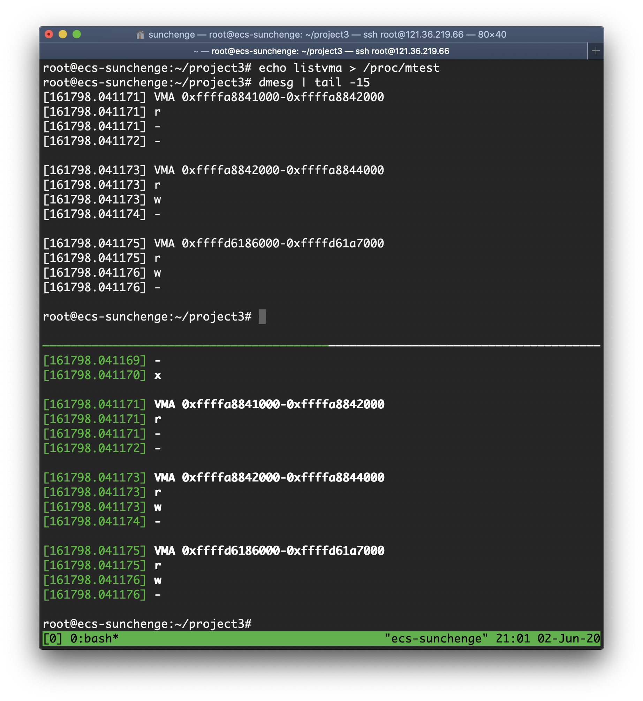
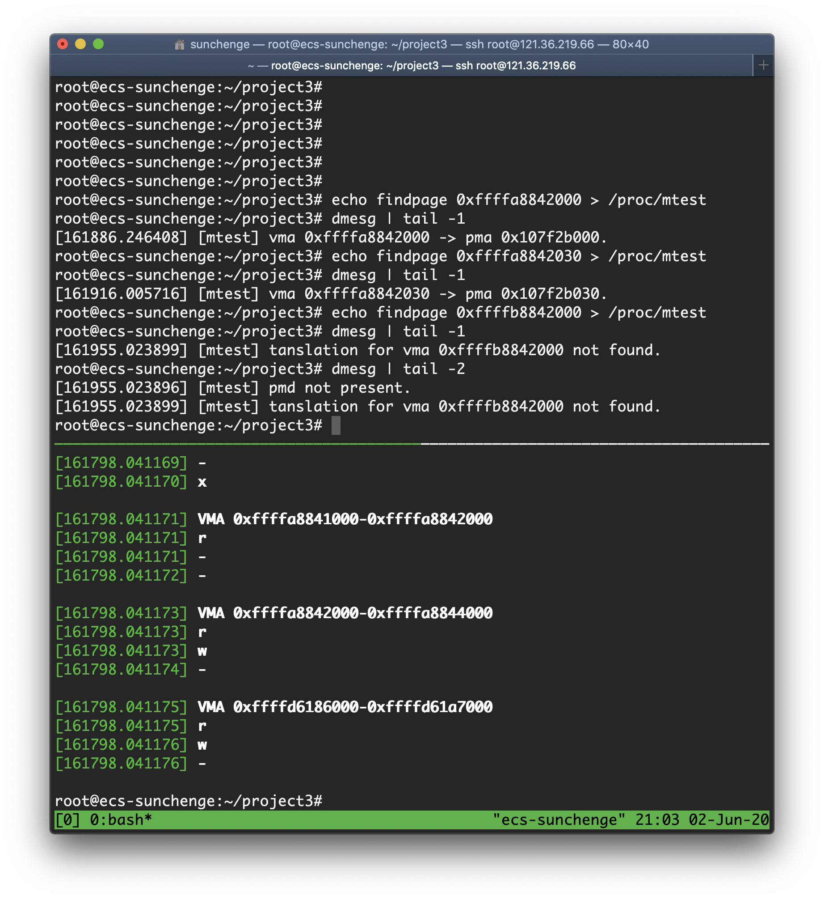
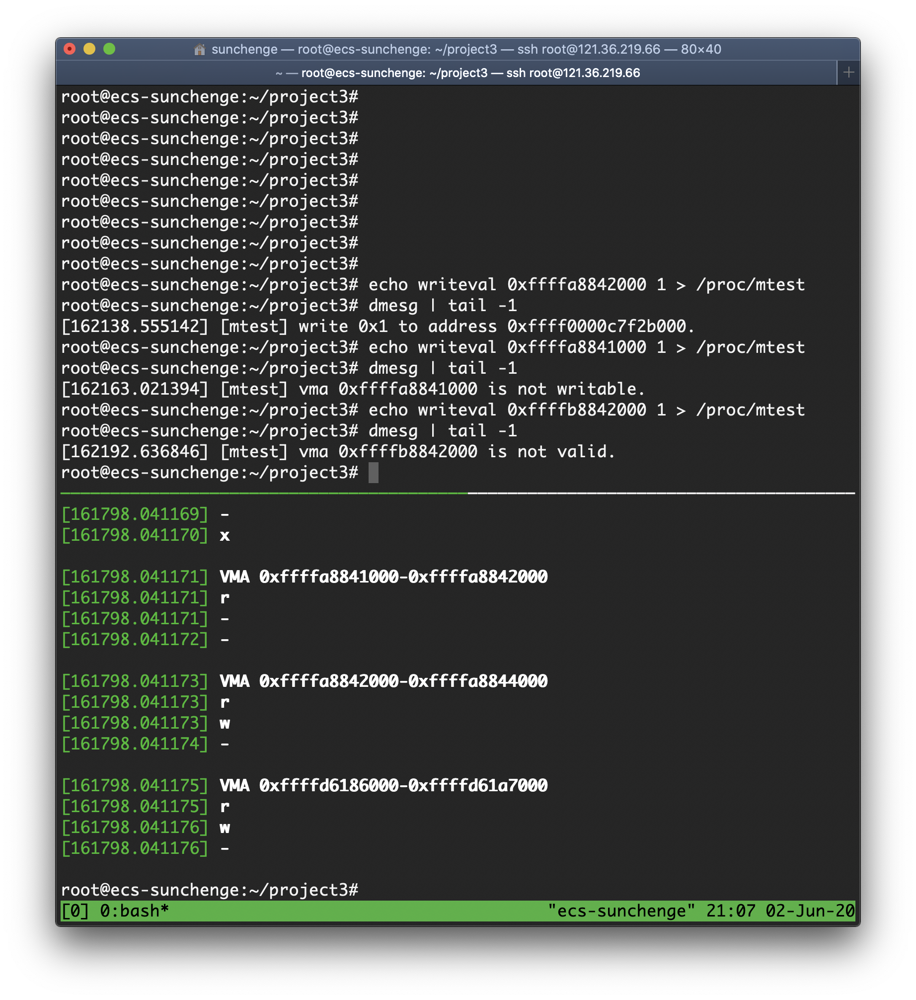
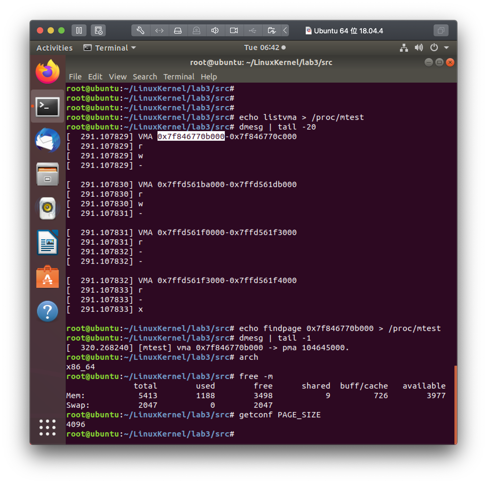

# <center>Linux Kernel Project 3 Report

<center>孙晨鸽 516030910421</center>

## 实验过程

* 内核版本 ： 5.5.9
* 平台: 华为云 x 鲲鹏通用计算增强型 | kc1.large.2 | 2vCPUs | 4GB x Ubuntu 18.04 64bit with ARM

### listvma

在```mm_types.h```中我们看到mm_struct类型中有```struct vm_area_struct *mmap```这样一个字段，
根据注释```/* list of VMAs */```可以得知这是进程的虚拟内存地址列表。
vm_area_struct类型中有vm_start,vm_end字段，是这段虚拟地址的前闭后开区间，
通过*vm_next, *vm_prev将vma列表串联起来，我们看到还有一个字段vm_flags，
注释引导我们去看mm.h中的flags，我们可以看到有VM_READ, VM_WRITE, VM_EXEC等字段用于描述这段vma的性质。
于是我们的listvma的实现就呼之欲出了。

### findpage

#### Linux的五级页表

根据```pgtable_types.h```我们可以看到

```c
#if CONFIG_PGTABLE_LEVELS > 4
typedef struct { p4dval_t p4d; } p4d_t;

static inline p4d_t native_make_p4d(pudval_t val)
{
	return (p4d_t) { val };
}

static inline p4dval_t native_p4d_val(p4d_t p4d)
{
	return p4d.p4d;
}
```
当CONFIG_PGTABLE_LEVEL > 4时，Linux增加了一个叫做p4d的层次，
这个层次位于pgd和pud之间，
课上提到的四级页表融合起来，我们可以得到Linux的五级页表结构：

pgd|p4d|pud|pmd|pte
---|---|---|---|---

通过上述结构的虚拟地址vma计算物理地址pma的过程即：
1. 通过pgd的基址+pgd得到p4d基址的地址，其中pgd的基址可以通过task_struct中的mm(mm_struct)字段中的pgd(pgd_t)字段获得。
2. 通过p4d的基址+p4d得到pud基址的地址
3. 通过pud的基址+pud得到pmd基址的地址
4. 通过pmd的基址+pmd得到pte基址的地址
5. 通过pte的基址+pte得到page的基址
6. page的基址+offset=物理地址

整个的计算过程可以通过```arch/arm64/include/asm/pgtable.h```中的宏和内联函数计算，
如获取p4d基址的地址，可以通过宏的方式：```pgd_offset(mm, address)```；
也可以通过直接计算的方式：

```c
mm->pgd+(((address) >> PGDIR_SHIFT) & (PTRS_PER_PGD - 1))
```

其中```mm->pgd```为pgd基址，通过位运算可以得到address中pgd的值：将虚拟地址右移，并取后八位（每个pgd表只有512项）。

同理的内联函数还有：
* ```static inline p4d_t *p4d_offset(pgd_t *pgd, unsigned long address)```
* ```static inline pud_t *pud_offset(p4d_t *p4d, unsigned long address)```
* ```static inline pmd_t *pmd_offset(pud_t *pud, unsigned long address)```
* ```static inline pte_t *pte_offset_kernel(pmd_t *pmd, unsigned long address)```

得到pte的基址后，我们可以通过宏```pte_page(*pte)```得到页描述符page，通过宏```page_to_phys(page)```得到页的物理地址，我们只需要将它与offset相加即可。

### writeval

根据listvma的实现我们知道，进程分配的vma中的flags字段表示了可写的性质，
我们可以通过```find_vma(mm, addr)```这一api获得vma->vm_end > addr的第一个vma，
判断vma->vm_start < addr且vma->flags可写，
我们可以通过findpage的方法找到该vma对应的物理页，
使用```page_address(page)```api获取物理页对应的kernel address。

<div STYLE="page-break-after: always;"></div>

## 实验效果

### lisvma



其中tmux上分屏中我们输入echo listvma > /proc/mtest
tmux下分屏中我们可以看到dmesg的信息。

<div STYLE="page-break-after: always;"></div>

### findpage



我们首先从tmux下分屏的dmesg中找到一个有效的vma：0xffffa8842000，我们可以看到dmesg中它被转化成了物理地址0x107f2b000。

更改offset，0xffffa8842030，得到物理地址0x107f2b030。

我们输入一个无效的vma：0xffffb8842000，此时输出tanslation for vma 0xffffb8842000 not found。原因是pmd not present。

<div STYLE="page-break-after: always;"></div>

### writeval



我们根据tmux下分屏dmesg得到一个可写的地址：
0xffffa661f000，写入1: echo writeval 0xffffa8842000 1 > /proc/mtest，得到写入结果write 0x1 to address 0xffff0000c7f2b000。

我们可以根据tmux下分屏dmesg中得到不可写的地0xffffa8841000，
我们试图写入1: echo writeval 0xffffa8841000 1 > /proc/mtest，得到结果： vma 0xffffa8841000 is not writable。

我们试图写一个无效地址：0xffffb8842000，
得到结果：vma 0xffffb8842000 is not valid。

<div STYLE="page-break-after: always;"></div>

## 实验心得

在实验过程中，我发现
在使用page_to_phys获取的物理地址如实验效果中的截图一样，
看起来似乎只有32位，考虑到我们用的华为云乌班图镜像的内存有4GB，32位的物理地址足够了。但是助教的demo中的物理地址的格式却是0xffff0000xxxxxxxx，是前16位为1，再16位为0的64位物理地址。因此我感到很迷惑，通过查看[源码](https://elixir.bootlin.com/linux/v5.5.9/source/arch/arm64/Kconfig#L874) 发现64位ARM架构（我们的华为云是这个配置的）下的物理地址是48或52位的，默认的物理地址是48位，
52位的地址依赖ARM64_64K_PAGES，
然而我getconf PAGESIZE了一下发现机器的页框大小是4KB，
感觉应该是48位物理地址了，但是我没有证据，
于是我又看了一下page_to_phys的实现
```#define page_to_phys(page)	(__pfn_to_phys(page_to_pfn(page)))```
是用页框号实现的，然而arm下面竟然找不到__pfn_to_phys的实现了！没关系，我们可以看一个相似的__pte_to_phys(pte)的[实现](https://elixir.bootlin.com/linux/v5.5.9/source/arch/arm64/include/asm/pgtable.h#L56)：

```c
#ifdef CONFIG_ARM64_PA_BITS_52
#define __pte_to_phys(pte)	\
	((pte_val(pte) & PTE_ADDR_LOW) | ((pte_val(pte) & PTE_ADDR_HIGH) << 36))
#define __phys_to_pte_val(phys)	(((phys) | ((phys) >> 36)) & PTE_ADDR_MASK)
#else
#define __pte_to_phys(pte)	(pte_val(pte) & PTE_ADDR_MASK)
#define __phys_to_pte_val(phys)	(phys)
#endif
```
只要我们在程序里自己算一下__pte_to_phys的实现到底是哪一个，我们不就知道机器物理地址的位数了吗？于是在编译的时候PTE_ADDR_HIGH就报错了，我们应该可以确定物理地址的位数是48位了。

那么问题来了，为什么我用page_to_phys(page)输出出来的看起来是32位的呢？
虽然我们找不到arm架构的实现，但我们可以看一下其他架构的实现，应该是相似的，我们看一下ia64的[实现](https://elixir.bootlin.com/linux/v5.5.9/source/arch/ia64/include/asm/page.h#L109)最终落脚到#define PFN_PHYS(x)	((phys_addr_t)(x) << PAGE_SHIFT)，就是这么简单粗暴的计算出来页框的编号然后移位页框的大小，那么我们page_to_phys(page)的输出看起来是32位的原因可能是前面的位都是0。

我们可以做一个实验来验证一下，我用了我自己的虚拟机，x86_64的ubuntu，将内存扩大到了5632MB（随便调的，只要比4GB大就可以了），这时我们可以看到page_to_phys的结果有33位了，可以说证实了之前的想法：如果物理地址看起来位数不太多，证明是我们的配置不行（误。



因为此事没有充分的调查还麻烦了助教学姐，感到十分不好意思【捂脸】