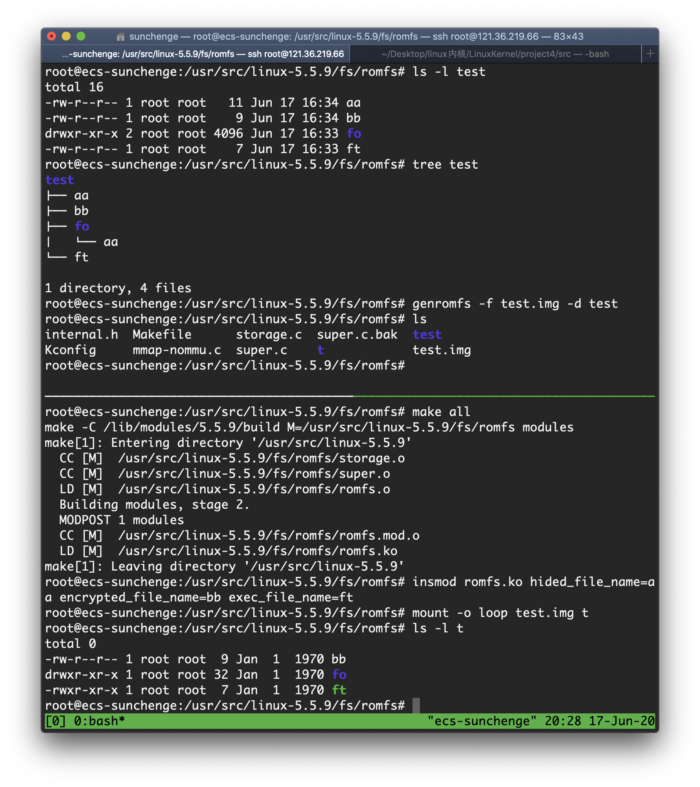
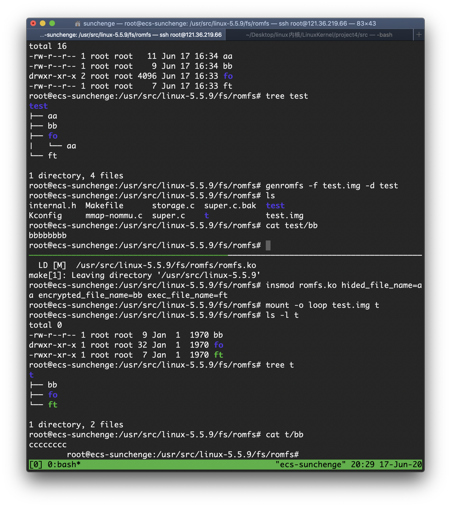

# <center>Linux Kernel Project 4 Report

<center>孙晨鸽 516030910421</center>

## 实验过程

* 内核版本 ： 5.5.9
* 平台: 华为云 x 鲲鹏通用计算增强型 | kc1.large.2 | 2vCPUs | 4GB x Ubuntu 18.04 64bit with ARM


### hided\_file\_name

在实验指导和函数名字的提示下，我们知道读取文件/目录是通过```romfs_readdir```实现，我们通过```romfs_dev_strnlen```读取文件名的长度，通过```romfs_dev_read```读取文件名，在```dir_emit```传输到VFS层之前跳过需要隐藏的文件。

### encrypted\_file\_name

读取文件的数据是通过```romfs_readpage```实现的，在```romfs_dev_read```将数据读取到```buf```之前我们需要加密文件的内容，我们选择对每一个```char```+1的方式加密文件内容。

难点在于如何获取文件名。通过实现hided_file_name，我们读了```romfs_readdir```的代码，可以得到读取文件名的方法。难点在于如何得到文件名的offset。我们可以看到```ROMFS_I(inode)```将inode转换成了```romfs_inode_info```。

```c
struct romfs_inode_info {
	struct inode	vfs_inode;
	unsigned long	i_metasize;	/* size of non-data area */
	unsigned long	i_dataoffset;	/* from the start of fs */
};
```

我们可以通过```i_dataoffset-i_metasize```获取到metadata的起始位置，文件名的offset即为```i_dataoffset-i_metasize+ROMFH_SIZE```。

### exec\_file\_name

```romfs_lookup```负责读取inode对象，由于```dentry->d_name.name```就是文件名，我们可以直接比较，并将```inode```的```i_mode```字段中```S_IXUGO```可执行的位置1。

## 实验效果

创建test文件夹，使用ls -l和tree命令查看test的结构如tmux上分屏，创建镜像test.img。

编译并插入模块romfs，隐藏名为aa的文件，加密名为bb的文件，名为ft的文件权限变为可执行。

将test.img挂载到目录t，使用ls -l和tree命令查看t的结构，发现aa被隐藏，ft权限变为可执行。



查看test中bb的内容为bbbbbbbb\n

查看t中bb的内容为cccccccc\v



## 实验心得

由于实验指导的提示，本次实验完成的比较顺利。